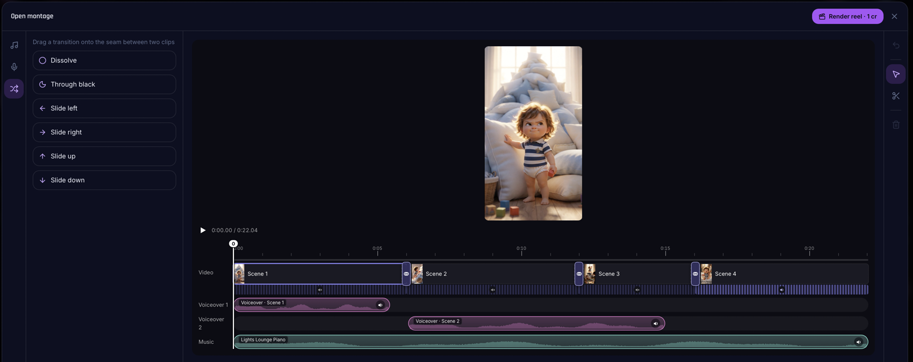
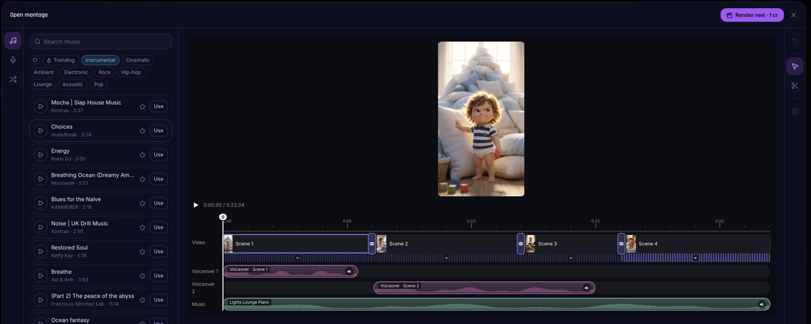
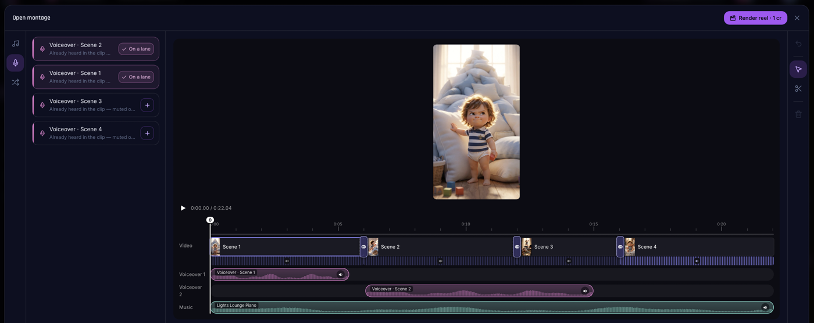

  <!-- Главный кадр: окно монтажа целиком (дорожки, волны, переходы, превью).
       Положи файл docs/cover.png — или перетащи картинку в редактор README
       на GitHub и подставь его ссылку в src. -->
  

<table>
  <tr>
    <!-- Три деталки в ряд: 1) переходы на стыке и их настройка;
         2) панель музыки (поиск/тренды/прослушка); 3) готовый ролик на
         карточке (плеер + скачать). Файлы: docs/shot-1.png … shot-3.png. -->
    <td></td>
    <td></td>
    <td></td>
  </tr>
</table>

# reelkit

**Многодорожечный монтажный движок для React** — сердце видеоредактора
[Orqanova](https://orqanova.com).

- 🎬 Композитный плеер таймлайна: видео-дорожка + независимые аудио-дорожки,
  единый медиа-плейхед (время не прыгает и не дрожит даже на стыках клипов);
- ✂️ Монтаж прямо в браузере: подрезка краёв, разрез, перетаскивание клипов и
  дорожек, громкость/mute на клип;
- 🔀 Переходы между клипами: растворение, «через чёрное», сдвиги во все четыре
  стороны — с настраиваемой длительностью и честным превью «кадр в кадр»
  с серверным рендером;
- 🎨 Ненавязчивый интерфейс: инлайн-стили, без CSS-зависимостей, i18n-агностик.

## Лицензия

Код проприетарный и распространяется **по коммерческой лицензии по запросу**.

Напишите нам: **investmaslov@gmail.com** — расскажем условия, покажем живое
демо и выдадим доступ.

---

Версии ≤ 0.3.2, опубликованные ранее под Apache-2.0, остаются под условиями
той лицензии. Всё последующее развитие — закрытое.
